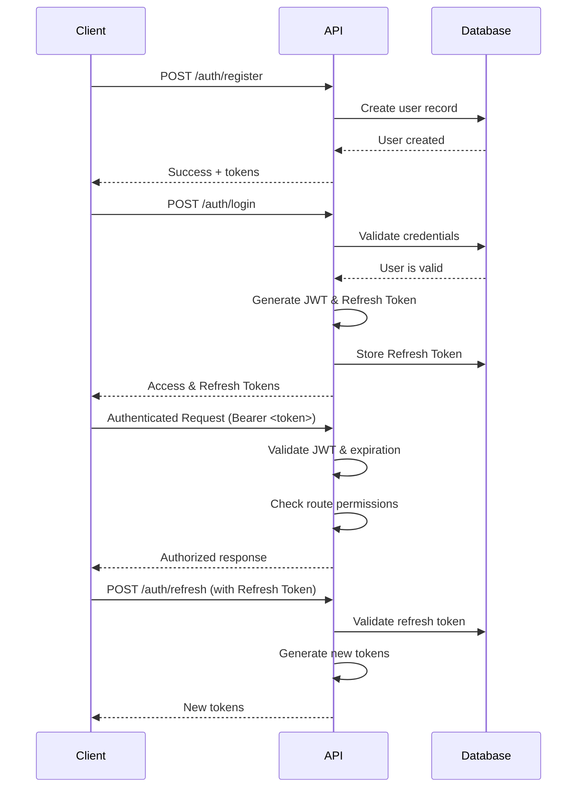

# CyberCore API - Complete Developer Guide

<p align="center">
  
  
  
  
  
</p>

## Table of Contents

1.  [Project Overview](#project-overview)
2.  [Architecture & Structure](#architecture--structure)
3.  [Setup & Installation](#setup--installation)
4.  [Core Features](#core-features)
5.  [API Endpoints Reference](#api-endpoints-reference)
6.  [Authentication & Authorization](#authentication--authorization)
7.  [Database Schema](#database-schema)
8.  [API Flow Sequences](#api-flow-sequences)
9.  [Development Workflow](#development-workflow)
10. [Testing](#testing)
11. [Deployment](#deployment)
12. [Troubleshooting](#troubleshooting)

---

## 1. Project Overview

**CyberCore** is a FAANG-level, enterprise-ready backend system built with TypeScript and Express.js. It provides a robust foundation for building secure, scalable, and maintainable applications.

### Key Features:

* **Multi-tenancy**: Support for multiple isolated organizations.
* **Role-Based Access Control (RBAC)**: Granular permissions system.
* **OAuth2-style Authentication**: JWT with secure refresh tokens.
* **Advanced User Management**: Comprehensive CRUD with bulk operations.
* **Audit Logging**: Complete activity tracking for compliance and security.
* **Real-time Notifications**: Extensible system for email and in-app notifications.
* **Data Export/Import**: GDPR compliance features for user data management.
* **Database Debugging Tools**: Secure endpoints for MongoDB introspection.

### Tech Stack

| Category         | Technology                               |
| ---------------- | ---------------------------------------- |
| **Runtime** | Node.js with TypeScript                  |
| **Framework** | Express.js                               |
| **Database** | MongoDB with Mongoose ODM                |
| **Authentication** | JSON Web Tokens (JWT) with refresh tokens |
| **Validation** | Joi                                      |
| **Logging** | Winston                                  |
| **File Upload** | Multer                                   |
| **Security** | Helmet, CORS, Rate Limiting              |

---
## 2. Architecture & Structure

The project follows a **modular, service-oriented architecture** to ensure separation of concerns, scalability, and maintainability.

```
src/
├── api/                  # API routes and controllers
│   ├── auth/             # Authentication endpoints
│   ├── users/            # User management endpoints
│   ├── tenants/          # Tenant management endpoints
│   └── debugDB/          # Database debugging endpoints
├── config/               # Configuration files (e.g., environment variables)
├── core/                 # Core application logic & services
│   ├── constants/        # Application constants and enums (e.g., roles)
│   ├── infra/            # Infrastructure setup (database, logger)
│   ├── middlewares/      # Express middlewares (auth, validation, error handling)
│   ├── models/           # MongoDB models and schemas
│   ├── services/         # Business logic services
│   ├── types/            # TypeScript type definitions and interfaces
│   └── validators/       # Joi request validation schemas
└── index.ts              # Application entry point
```

---
### Design Patterns Used

* **Service Layer Pattern**: Business logic is encapsulated in services, keeping controllers lean.
* **Repository Pattern**: Mongoose models act as a data access layer, abstracting database interactions.
* **Middleware Pattern**: Cross-cutting concerns like authentication, validation, and logging are handled by Express middlewares.
* **Factory Pattern**: Used for dynamically creating instances of services or objects.
* **Observer Pattern**: Implemented for the event-driven notification system.

---

## 3. Setup & Installation

### Prerequisites

* **Node.js**: `>= 18.0.0`
* **MongoDB**: `>= 6.0.0`
* **npm**: `>= 8.0.0`

### Installation Steps

1.  **Clone and Install Dependencies**

    ```bash
    git clone <repository-url>
    cd cybercore-api
    npm install
    ```

2.  **Environment Configuration**

    Create a `.env` file in the root directory by copying the example file.

    ```bash
    cp .env.example .env
    ```

    Update the `.env` file with your configuration. **Generate strong, unique secrets for production.**

    ```bash
    # Database
    MONGODB_URI=mongodb://localhost:27017/cybercore

    # JWT Secrets (Use a secure random string generator)
    JWT_SECRET=your-super-secure-jwt-secret-here
    JWT_REFRESH_SECRET=your-super-secure-refresh-secret-here
    JWT_EXPIRES_IN=15m
    JWT_REFRESH_EXPIRES_IN=7d

    # Server Configuration
    NODE_ENV=development
    PORT=3000

    # Rate Limiting
    RATE_LIMIT_WINDOW=900000  # 15 minutes in ms
    RATE_LIMIT_MAX=100        # 100 requests per window per IP

    # Optional: Seed Data
    SEED_SUPERADMIN_PASSWORD=SuperSecurePassword123!

    # Email Configuration (Optional)
    EMAIL_USER=your-email@domain.com
    EMAIL_PASS=your-email-password
    DEFAULT_FROM_EMAIL=noreply@cybercore.com

    # Frontend URL (for email links)
    FRONTEND_URL=http://localhost:3000
    ```

3.  **Start MongoDB**

    You can use a local MongoDB service or Docker.

    ```bash
    # Using MongoDB service (e.g., on Linux)
    sudo systemctl start mongod

    # Or using Docker
    docker run -d -p 27017:27017 --name mongodb mongo:latest
    ```

4.  **Run the Application**

    ```bash
    # Development mode with hot reload
    npm run dev

    # Build for production
    npm run build

    # Start production server
    npm start
    ```

5.  **Run Tests**

    ```bash
    npm test
    ```

### Database Seeding

On the first run, the application automatically seeds the database with essential data:

* **Default Tenant**: A "Cybercore" organization.
* **Super Admin User**: `superadmin@cybercore.com`.
* **Default Password**: The value from `SEED_SUPERADMIN_PASSWORD` in your `.env` file.

---

## 4. Core Features

### 1. Multi-Tenancy

The system is designed to support multiple organizations (tenants) with complete data isolation. Each user is associated with a tenant, and their access is restricted to their tenant's data.

### 2. Role-Based Access Control (RBAC)

A flexible RBAC system controls what users can see and do.

```typescript
// src/core/constants/roles.ts
export enum UserRole {
  SUPER_ADMIN = 'SUPER_ADMIN',    // Full system access, manages tenants
  TENANT_ADMIN = 'TENANT_ADMIN',  // Manages users and settings within a tenant
  USER = 'USER'                   // Basic user with limited access
}
```


### 3. Permission System
Permissions are granular and assigned to roles. This allows for fine-tuned control over API endpoints.

```typescript
// src/core/constants/permissions.ts
export const PERMISSIONS = {
  'user:create': [UserRole.SUPER_ADMIN, UserRole.TENANT_ADMIN],
  'user:read':   [UserRole.SUPER_ADMIN, UserRole.TENANT_ADMIN, UserRole.USER],
  'user:update': [UserRole.SUPER_ADMIN, UserRole.TENANT_ADMIN],
  'user:delete': [UserRole.SUPER_ADMIN, UserRole.TENANT_ADMIN],
  'tenant:create': [UserRole.SUPER_ADMIN],
  // ... and many more permissions
};
```


### 4. Advanced User Management
- Full CRUD and robust validation
- Bulk operations (activate, deactivate, role changes)
- Advanced search, filters, pagination, and audit logs
- Profile picture uploads and session/device tracking
### 5. Security Features
- Authentication: Secure JWTs with refresh token rotation.
- Rate Limiting: Protection against brute-force attacks on sensitive endpoints.
- Password Security: Strong password policies and hashing (bcrypt).
- Input Validation: Sanitization and validation of all incoming data.
- Secure Headers: helmet middleware for protection against common web vulnerabilities.
- CORS: Configurable Cross-Origin Resource Sharing.
- Audit Logging: Recording of all sensitive actions for security analysis.
## 5. API Endpoints Reference

_All endpoints prefixed by `/api/v1`._

### Authentication Endpoints (`/auth`)

| Method | Endpoint      | Description                 | Auth        |
| ------ | -------------| --------------------------- | ----------- |
| POST   | /register    | Register a new user         | No          |
| POST   | /login       | Log in a user               | No          |
| POST   | /refresh     | Get a new access token      | No (Refresh)|
| POST   | /logout      | Log out a user              | Yes         |
| GET    | /me          | Get current user's info     | Yes         |

### User Management Endpoints (`/users`)

| Method | Endpoint                  | Description                       | Auth | Permission          |
| ------ | ------------------------- | --------------------------------- | ---- | ------------------- |
| GET    | /                         | Get paginated list of users       | Yes  | user:read           |
| GET    | /search                   | Advanced user search              | Yes  | user:read           |
| GET    | /stats                    | Get user analytics                | Yes  | analytics:read      |
| GET    | /export                   | Export user data                  | Yes  | user:export         |
| GET    | /role/:role               | Get users by specific role        | Yes  | user:list           |
| GET    | /:id                      | Get user details by ID            | Yes  | user:read           |
| PUT    | /:id                      | Update user details               | Yes  | user:update         |
| DELETE | /:id                      | Soft delete a user                | Yes  | user:delete         |
| POST   | /bulk                     | Perform bulk operations           | Yes  | user:bulkEdit       |
| PATCH  | /:id/status               | Activate/deactivate user          | Yes  | user:update         |
| POST   | /:id/reset-password       | Admin-initiated password reset    | Yes  | user:resetPassword  |
| POST   | /:id/profile-picture      | Upload profile picture            | Yes  | user:update         |
| GET    | /:id/activity             | Get user activity log             | Yes  | user:read           |
| GET    | /:id/permissions          | Get effective permissions         | Yes  | user:read           |
| GET    | /:id/sessions             | Get user active sessions          | Yes  | user:read           |
| DELETE | /:id/sessions             | Invalidate all user sessions      | Yes  | user:update         |
| POST   | /invite                   | Invite a new user via email       | Yes  | user:invite         |
| POST   | /activate                 | Activate invited user account     | No   | -                   |

### Tenant Management Endpoints (`/tenants`)

| Method | Endpoint   | Description            | Auth | Permission      |
| ------ | ----------| ---------------------- | ---- | ---------------|
| POST   | /         | Create tenant          | Yes  | tenant:create   |
| GET    | /         | List tenants           | Yes  | tenant:read     |
| GET    | /:id      | Get tenant details     | Yes  | tenant:read     |
| PUT    | /:id      | Update tenant          | Yes  | tenant:update   |
| DELETE | /:id      | Deactivate tenant      | Yes  | tenant:delete   |

### Database Debug Endpoints (`/debug`)

| Method | Endpoint                      | Description                | Auth | Permission       |
| ------ | ----------------------------- | -------------------------- | ---- | ---------------- |
| GET    | /health                       | Database health check      | Yes  | -                |
| GET    | /overview                     | Database overview          | Yes  | database:admin   |
| GET    | /collection/:name/info        | Get collection info        | Yes  | database:admin   |
| GET    | /collection/:name/documents   | Get sample documents       | Yes  | database:admin   |

---

## 6. Authentication & Authorization

### Authentication Flow

<details>
<summary>Click to expand authentication flow diagram</summary>



</details>

---

### JWT Token Structure

The payload of the JWT contains essential, non-sensitive information for authorization.

```ts
interface AuthPayload {
  userId: string;
  tenantId: string;
  role: UserRole;
  permissions: string[];
}
```

---

### Authorization Middleware

Routes are protected using a combination of `authenticate` and `authorize` middlewares.

```ts
import { authenticate, authorize } from '@/core/middlewares';

// 1. Authenticate: Validates the JWT token and attaches the user payload to the request.
router.get('/:id', authenticate, controller.getUser);

// 2. Authorize: Checks if the authenticated user has the required permission.
router.delete('/:id', authenticate, authorize('user:delete'), controller.deleteUser);
```

---

## 7. Database Schema

### User Model (IUser)
```typescript
interface IUser {
  email: string;
  password: string; // Hashed
  firstName: string;
  lastName: string;
  role: UserRole;
  tenantId: ObjectId;
  isActive: boolean;
  lastLogin?: Date;
  preferences: {
    language: string;
    timezone: string;
    theme: 'light' | 'dark' | 'auto';
    notifications: object; // Detailed notification settings
  };
  createdAt: Date;
  updatedAt: Date;
}
```


### Tenant Model (ITenant)
```typescript
interface ITenant {
  name: string;
  domain: string;      // e.g., acme.com
  subdomain: string;   // e.g., acme
  settings: {
    maxUsers: number;
    features: string[];
    plan: 'free' | 'pro' | 'enterprise';
  };
  isActive: boolean;
  isDefault: boolean; // Is this the default tenant for new registrations?
  createdAt: Date;
  updatedAt: Date;
}
```

### Refresh Token Model (IRefreshToken)
```typescript
interface IRefreshToken {
  userId: ObjectId;
  token: string;
  expiresAt: Date;
  isRevoked: boolean;
  createdAt: Date;
}
```

---

## 8. API Flow Sequences

<details>
<summary><strong>1. User Registration Flow</strong></summary>

**Endpoint:** `POST /api/v1/auth/register`

* Validate input (email, password, names) using Joi schema.
* Check if a user with the given email already exists.
* Assign the user to the default tenant (if no tenantId is provided).
* Hash the password using bcrypt.
* Create the new user record in the database.
* Generate a new JWT and refresh token.
* Store the refresh token in the `refreshtokens` collection.
* Return the new user data (without password) and the tokens.

**Response:**

```json
{
  "success": true,
  "data": {
    "user": {
      "id": "...",
      "email": "...",
      "firstName": "...",
      "lastName": "...",
      "role": "...",
      "tenantId": "..."
    },
    "tokens": {
      "accessToken": "...",
      "refreshToken": "..."
    }
  },
  "message": "User registered successfully"
}
```

</details>


<details>
<summary><strong>2. User Login Flow</strong></summary>

**Endpoint:** `POST /api/v1/auth/login`

* Validate the email and password format.
* Find the user by their email address.
* Check if the user account is active.
* Compare the provided password with the stored hash.
* Update the `lastLogin` timestamp for the user.
* Generate a new set of JWT and refresh tokens.
* Store the new refresh token.
* Return the user data and tokens.

**Follow-up:** `GET /api/v1/auth/me`

* The client sends the `accessToken` in the `Authorization: Bearer <token>` header.
* The `authenticate` middleware validates the token.
* The controller fetches the full user details from the database.
* Returns the current user's information.

</details>

<details>
<summary><strong>3. User Management Flow</strong></summary>

**GET /api/v1/users (List Users)**

* Authenticate the request and check for `user:read` permission.
* Apply RBAC filtering: `SUPER_ADMIN` sees all users, `TENANT_ADMIN` sees users in their tenant.
* Parse query parameters (page, limit, search, filters).
* Build and execute a MongoDB aggregation pipeline to fetch, sort, and paginate users.
* Cache the response to improve performance for subsequent requests.
* Return the paginated list of users.

**GET /api/v1/users/\:id (Get User Details)**

* Authenticate and authorize.
* Check cache for the user data first.
* Apply RBAC filter to ensure the requesting user has access.
* Fetch the user and enhance the data with computed fields (e.g., full name, online status).
* Sanitize sensitive data based on the requester's permissions.
* Cache and return the enhanced user data.

**PUT /api/v1/users/\:id (Update User)**

* Authenticate and authorize (`user:update`).
* Validate the incoming data against the update schema.
* Enforce business rules (e.g., prevent self-deactivation, validate role changes).
* Detect which fields have changed to create a detailed audit log.
* Update the user record.
* Invalidate any related caches.
* Log the update in the audit trail and send notifications if necessary.
* Return the updated user data.

**DELETE /api/v1/users/\:id (Delete User)**

* Authenticate and authorize (`user:delete`).
* Prevent self-deletion and check role hierarchy.
* Perform a soft delete by setting `isActive = false` and recording deletion details.
* Clean up the user's active sessions by revoking their refresh tokens.
* Invalidate caches, log the audit activity, and send notifications.
* Return a confirmation message.

</details>

<details>
<summary><strong>4. Bulk Operations Flow</strong></summary>

**Endpoint:** `POST /api/v1/users/bulk`

* Authenticate and authorize (`user:bulkEdit`).
* Validate the request body (array of userIds, operation type).
* Fetch the target users, applying RBAC filters.
* For each user, validate that the operation is permissible (e.g., an admin can't delete a super admin).
* Execute the operation for each valid user (e.g., update status, change role).
* Collect the results, noting successes and failures.
* Log the bulk operation in the audit trail.
* Return a summary of the operation.

</details>

<details>
<summary><strong>5. Advanced Search Flow</strong></summary>

**Endpoint:** `GET /api/v1/users/search`

* Authenticate, authorize, and apply rate limiting.
* Build a base query with RBAC filters.
* Construct a complex search query using `$or` to check multiple fields (email, name, etc.) with various strategies (exact, starts-with, contains).
* Execute the search using an aggregation pipeline.
* Simultaneously, build facets for filtering options on the frontend (e.g., counts by role, status).
* Generate "Did you mean?" suggestions if the search yields no results.
* Return the search results, facets, and suggestions.

</details>

<details>
<summary><strong>6. Data Export Flow</strong></summary>

**Endpoint:** `GET /api/v1/users/export?format=csv`

* Authenticate, authorize (`user:export`), and apply strict rate limiting.
* Validate export parameters (format, columns, filters).
* Enforce record limits to prevent server overload (e.g., max 100k for CSV).
* Fetch the data in chunks.
* Sanitize the data based on the user's permissions.
* Generate the file in the requested format (CSV, PDF, Excel, JSON).
* Log the export activity in the audit trail.
* Stream the generated file to the client with the correct `Content-Type` headers.

</details>

---

## 9. Development Workflow

### 1. Adding New Features

**Create a feature branch:**

```bash
git checkout -b feature/new-cool-feature
```

**File structure:**

* Add/Modify Model: `src/core/models/NewModel.ts`
* Add Service Layer: `src/core/services/NewService.ts`
* Add Validation Schemas: `src/core/validators/newValidators.ts`
* Add Controller: `src/api/new-feature/controller.ts`
* Add Routes: `src/api/new-feature/routes.ts`

**Register routes in `src/index.ts`:**

```ts
app.use('/api/v1/new-feature', newFeatureRoutes);
```

**Write tests:**

```bash
npm test
```

**Commit and push:**

```bash
git commit -m "feat: add new cool feature"
git push origin feature/new-cool-feature
```

---

### 2. Code Standards

* **TypeScript:** Strict mode is enabled. Use path mapping (`@/`) for clean imports.

**Naming Conventions:**

* Files: `camelCase.ts`
* Classes: `PascalCase`
* Functions: `camelCase`
* Constants: `UPPER_SNAKE_CASE`
* Interfaces: `IPascalCase` (e.g., `IUser`)

**Error Handling:**

* Use the custom `AppError` class for expected, operational errors:

```ts
throw new AppError('User not found', 404);
```

* Use `try...catch` blocks for all async operations.
* Pass unexpected errors to the global error handler using `next(error)`.

---

### 3. Adding New Permissions

* Add the permission string to `src/core/constants/permissions.ts`.
* Assign the new permission to the appropriate roles.
* Use the `authorize('new-permission:action')` middleware in the relevant route.

---

## 10. Testing

### Test Structure

* **Unit Tests:** `src/core/services/__tests__/`
* **Integration Tests:** `src/api/__tests__/`
* **End-to-end Tests:** `tests/e2e/`

---

### Running Tests

```bash
# Run all tests
npm test

# Run tests with code coverage report
npm run test:coverage

# Run a specific test file
npm test -- UserService.test.ts

# Run tests in watch mode during development
npm run test:watch
```

---

### Test Examples

#### Unit Test Example

> File: `src/core/services/__tests__/UserService.test.ts`

```ts
describe('UserService', () => {
  it('should create a user successfully with valid data', async () => {
    const userData = { email: 'test@example.com', /* ... */ };
    const user = await UserService.createUser(userData);
    expect(user).toBeDefined();
    expect(user.email).toBe(userData.email);
  });
});
```

---

#### Integration Test Example

> File: `src/api/__tests__/users.test.ts`

```ts
describe('POST /api/v1/users', () => {
  it('should return 201 and create a user when authenticated as an admin', async () => {
    const response = await request(app)
      .post('/api/v1/users')
      .set('Authorization', `Bearer ${adminToken}`)
      .send(validUserData)
      .expect(201);

    expect(response.body.success).toBe(true);
    expect(response.body.data.user.email).toBe(validUserData.email);
  });
});
```
---

## 11. Deployment

### Production Environment Variables

Ensure these variables are set in your production environment. **NEVER commit production secrets.**

```env
NODE_ENV=production
PORT=3000
MONGODB_URI=mongodb://production-server:27017/cybercore

# Generate strong, 256-bit secrets for production
JWT_SECRET=production-jwt-secret-256-bits-minimum
JWT_REFRESH_SECRET=production-refresh-secret-256-bits-minimum

# Email service configuration
EMAIL_USER=noreply@yourdomain.com
EMAIL_PASS=production-email-password
SMTP_HOST=smtp.yourdomain.com
SMTP_PORT=587

# Rate limiting
RATE_LIMIT_WINDOW=900000
RATE_LIMIT_MAX=100

# Monitoring
LOG_LEVEL=info
```

---

### Docker Deployment

A `Dockerfile` and `docker-compose.yml` are provided for easy containerization.

#### Dockerfile

```dockerfile
# Use an official Node.js runtime as a parent image
FROM node:18-alpine

# Set the working directory in the container
WORKDIR /app

# Copy package.json and package-lock.json
COPY package*.json ./

# Install only production dependencies
RUN npm ci --only=production

# Copy the compiled application code
COPY dist ./dist

# Expose the port the app runs on
EXPOSE 3000

# Define the command to run the application
CMD ["node", "dist/index.js"]
```

#### docker-compose.yml

```yaml
version: '3.8'

services:
  app:
    build: .
    ports:
      - "3000:3000"
    environment:
      - NODE_ENV=production
      - MONGODB_URI=mongodb://mongo:27017/cybercore
      # ... other production environment variables
    depends_on:
      - mongo

  mongo:
    image: mongo:6
    volumes:
      - mongo_data:/data/db

volumes:
  mongo_data:
```

---

### Build and Deploy

```bash
# 1. Build the TypeScript code for production
npm run build

# 2. Start the production server directly
npm start

# 3. Or, for better process management, use PM2
npm install -g pm2
pm2 start dist/index.js --name cybercore-api
```

---

## 12. Troubleshooting

### Common Issues

#### JWT Token Errors: Invalid or expired token

* Verify the `JWT_SECRET` environment variable matches the one used to sign the token.
* Ensure the `Authorization` header is formatted correctly:

  ```
  Bearer <token>
  ```
* Check if the token has expired.

---

#### Database Connection Errors: MongoDB connection failed

* Verify that your MongoDB instance is running.
* Check that the `MONGODB_URI` is correct.
* Ensure your server's IP is whitelisted if connecting to a cloud database.

---

#### Permission Denied Errors: Insufficient permissions

* Check the user's role and the permissions assigned to that role.
* Verify the `authorize()` middleware is correctly implemented on the route.

---

#### Rate Limiting Errors: Too many requests

* The client should implement an exponential backoff strategy.
* Consider whitelisting trusted IP addresses if necessary.

---

### Debug Mode

Enable debug logging for more verbose output during development.

```bash
# Enable all debug logs
DEBUG=* npm run dev

# Enable logs for a specific module
DEBUG=cybercore:auth-service npm run dev
```

---

### Monitoring and Logging

**View Logs in Production (with PM2):**

```bash
pm2 logs cybercore-api
```

**Monitor Performance (with PM2):**

```bash
pm2 monit
```

**View Database Debug Info (requires admin permissions):**

```http
GET /api/v1/debug/overview
```

---

### Health Checks

**Basic Health Check:**

```bash
curl http://localhost:3000/health
```

**Database Health Check (Authenticated):**

```bash
curl -H "Authorization: Bearer <admin_token>" http://localhost:3000/api/v1/debug/health
```
---
## License

This project is licensed under the [MIT License](./LICENSE).

---

## 🤝 Contributing

We welcome contributions to improve **CyberCore**. Feel free to open issues, suggest features, or submit pull requests to make this project better.

---

## 💡 Stay Connected

* Star this repository to support the project.
* Watch for updates to get notified about new features.
* Share your feedback and let us know how you use **CyberCore** in your projects.

---

## 🚀 Happy Hacking!

Made with ❤️ by the **CyberCore Team**. Build boldly, learn relentlessly, and ship with confidence.

---
